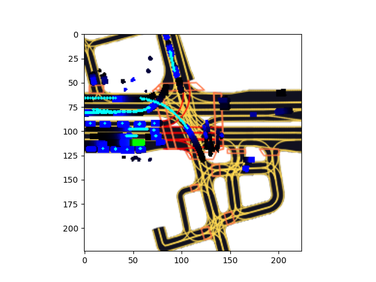

# Motion Prediction for Autonomous Vehicles

 



This is the final project of CMU 16824 Visual Learning and Recognition. We designed a simple regression CNN pipeline to predict the agents' motion for the autonomous vehicle and trained on multi-channel images with negative log-likelihood loss function. 

This repo heavily rely on the l5kit tool, please follow below steps to install dependencies and download the Lyft dataset first.

## Run Model 

1. Install [Lyft Tool Kits](https://github.com/lyft/l5kit):

   ```
   git clone https://github.com/lyft/l5kit.git
   cd l5kit/l5kit
   ```

   If you don't care about dependency builds or you're having troubles with packages resolution, you can modify the `setup.py` and then running:

   ```
   pip install -e ."[dev]"
   ```

2. Download Lyft dataset following instructions on [Kaggle](https://www.kaggle.com/c/lyft-motion-prediction-autonomous-vehicles/data) or simply using Kaggle API:

   ```
   kaggle competitions download -c lyft-motion-prediction-autonomous-vehicles
   ```

   After unzip all files, you should get the folder structure same as this:

   ```
   ├── Lyft-data
   │   ├── README.md
   │   ├── aerial_map
   │   │   ├── LICENSE
   │   │   ├── aerial_map.png
   │   │   ├── feedback.txt
   │   │   └── nearmap_images
   │   ├── meta.json
   │   ├── multi_mode_sample_submission.csv
   │   ├── scenes
   │   │   ├── mask.npz
   │   │   ├── sample.zarr
   │   │   ├── test.zarr
   │   │   ├── train.zarr
   │   │   └── validate.zarr
   │   ├── semantic_map
   │   │   ├── LICENSE
   │   │   ├── feedback.txt
   │   │   └── semantic_map.pb
   │   └── single_mode_sample_submission.csv
   ```

   

3. Modify the arguments in `agent_motion_config.yaml`, and change the dataset path in the `train.py` then you are all set to go by `python train.py` !


## Report

Final report will come soon!